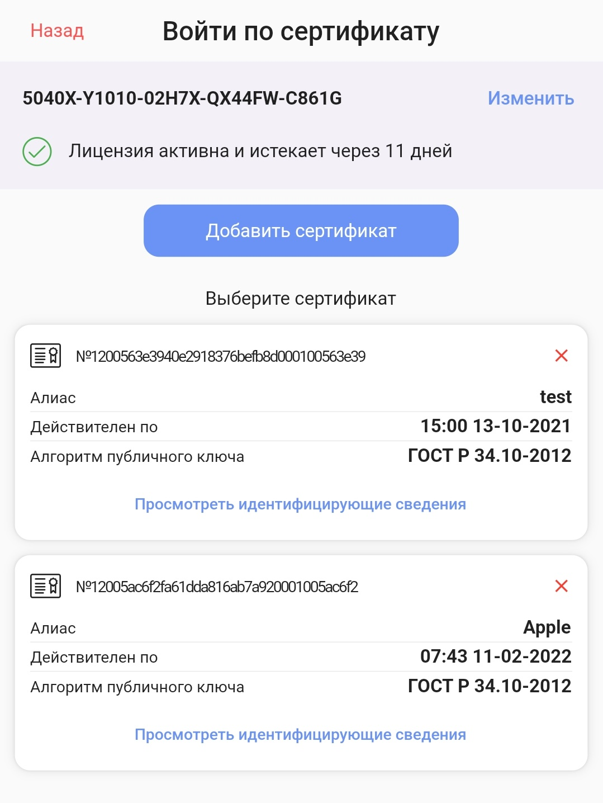

# Плагин на Flutter для формирования электронной цифровой подписи с помощью алгоритмов ГОСТ Р 34.10-2012

## __Описание__
Плагин принимает сертификаты в формате __PKCS12__ ```.pfx```

Приватный ключ должен быть помечен как экспортируемый

Поддерживаемые алгоритмы для Android: __GOST R 34.10-2001__, __GOST R 34.10-2012__, __GOST R 34.10-2012 Strong__

Поддерживаемые архитектуры для Android: __arm64-v8a__, __armeabi-v7a__

Поддерживаемые алгоритмы для iOS: __GOST R 34.10-2012__


## __Установка__
### __Подключение плагина к Android проекту__
1. Скопировать ```.aar``` библиотеки из ```android/libs``` плагина к себе в проект в ```android\app\libs```

2. Добавить в ```build.gradle```
```gradle
minSdkVersion 24

buildTypes {
        release {
            shrinkResources false
            minifyEnabled false
            proguardFiles getDefaultProguardFile('proguard-android.txt'), 'proguard-rules.pro'
        }
    }

packagingOptions {
    jniLibs {
        useLegacyPackaging = true
    }
}

dependencies {
    implementation fileTree(dir: 'libs', include: '*.aar')
}
```

3. Создать файл ```proguard-rules.pro``` в ```android/app```
```pro
-keep public class ru.CryptoPro.*
```

Библиотеки .aar указаны в плагине как compile-only, так как невозможно к .aar (коим является этот плагин) подключать другие .aar, для этого требуется скопировать их к себе в проект и подключить как implementation. Proguard используется, чтобы запретить обфускацию кода, которая происходить при выполнении релизной сборки.

### __Подключение плагина к iOS проекту__
Добавить папки ```en.lproj, locale, ru.lproj``` и файлы ```kis_1, root.sto, config.ini, license.enc``` из ```ios/Resources``` плагина к себе в проект через Xcode.

## __Использование__
Работа с плагином выполнятся через собственный интерфейс плагина и его методы.

### __Использование через интерфейс__
```dart
CryptSignature.interface
```
При вызове данного метода открывается экран с возможностью добавления/выбора/хранения сертификатов.

<br><br>

Описание режимов работы:
* ```MessageInterfaceRequest```
    * Высчитывает хэш от сообщения, подписывает его и возвращает сигнатуру в формате Base64.
* ```PKCS7InterfaceRequest```
    1. При выборе сертификата пользователем, получает сообщение через функцию ```getMessage```
    2. Высчитывает хэш от полученного сообщения
    3. Android: Формирует PKCS7 и атрибуты подписи. iOS: получает атрибуты подписи от функции ```getSignedAttributes```
    4. Высчитывает хэш от атрибутов подписи
    5. Подписывает этот хэш атрибутов
    6. Android: Вставляет сигнатуру в PKCS7 и возвращает этот PKCS7 в формате Base64. iOS: возвращает сигнатуру
* ```PKCS7HASHInterfaceRequest```<br>
    * Работает как и ```PKCS7InterfaceRequest```, но не высчитывает хэш от первоначального сообщения.
    * При выборе сертификата пользователем, получает хэш для подписи через функцию ```getDigest```.
* ```CustomInterfaceRequest```<br>
    * Создан для выполнения собственной логики ЭП, но с использования интерфейса плагина.

Пример работы режимов:
* ```MessageInterfaceRequest```
    <br>
    Применяется, когда у проверяющего есть сертификат пользователя и он хочет только проверить ЭП. Например, аутентификация путем ЭП случайного набора байт.
* ```PKCS7InterfaceRequest```
    <br>
    Применяется, когда у проверяющего нет информации о сертификате пользователя и дополнительной информации. Например, регистрация путем ЭП случайного набора байт.
* ```PKCS7HASHInterfaceRequest```
    <br>
    Применяется, когда с сервера нецелесообразно передавать изначальное сообщение (из-за его большого размера к примеру). Тогда на выполнение ЭП передается уже готовый хэш от этого сообщения. Например, ЭП документов.

### __Использование через методы__
* Инициализировать провайдер
    ```dart
    CryptSignature.initCSP()
    ```
* Установить новую лицензию
    ```dart
    CryptSignature.setLicense(String license)
    ```
* Получить информацию о текущей лицензии
    ```dart
    CryptSignature.getLicense()
    ```
* Добавить сертификат в хранилище
    ```dart
    CryptSignature.addCertificate(File file, String password)
    ```
* Получить список сертификатов, добавленных пользователем
    ```dart
    CryptSignature.getCertificates()
    ```
* Очистить список сертификатов
    ```dart
    CryptSignature.clear()
    ```
* Вычислить хэш сообщения/документа
    ```dart
    CryptSignature.digest(Certificate certificate, String password, String message)
    ```
* Вычислить подпись хэша
    ```dart
    CryptSignature.sign(Certificate certificate, String password, String digest)
    ```
* Создать ```PKCS7``` и атрибуты подписи на основе ```digest```
    ```dart
    CryptSignature.createPKCS7(Certificate certificate, String password, String digest)
    ```
* Прикрепить к ```PKCS7``` сигнатуру ```signature```
    ```dart
    CryptSignature.addSignatureToPKCS7(PKCS7 pkcs7, String signature)
    ```

## __Пример__
### Пример использования плагина через интерфейс
```dart
SignResult result = await CryptSignature.interface(context, MessageInterfaceRequest("СООБЩЕНИЕ_В_BASE64"));
```

```dart
Future<String> getMessage(Certificate certificate) async {
    /// Запрос на сервер с выбранным сертификатом для формирования сообщения
    return message;
}
PKCS7 result = await CryptSignature.interface(context, PKCS7InterfaceRequest(getMessage));
```
### Пример использования плагина через методы

```dart
await CryptSignature.initCSP();
/// Получение файла .pfx и запрос пароля
Certificate certificate = await CryptSignature.addCertificate(file, password);
/// Получение сообщения для ЭП
DigestResult digestResult = await CryptSignature.digest(certificate, password, message);
SignResult signResult = await CryptSignature.sign(certificate, password, digestResult.digest);
print(signResult.signature);
```